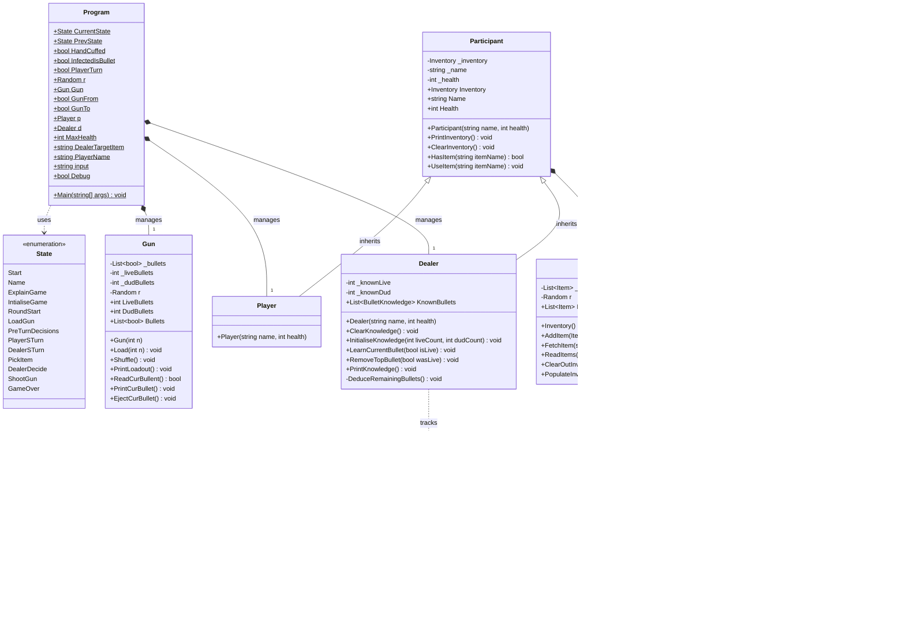

```mermaid
classDiagram
    direction TB

    class Program {
        +State CurrentState$
        +State PrevState$
        +bool HandCuffed$
        +bool InfectedIsBullet$
        +bool PlayerTurn$
        +Random r$
        +Gun Gun$
        +bool GunFrom$
        +bool GunTo$
        +Player p$
        +Dealer d$
        +int MaxHealth$
        +string DealerTargetItem$
        +string PlayerName$
        +string input$
        +bool Debug$
        +Main(string[] args)$ void
    }

    class State {
        <<enumeration>>
        Start
        Name
        ExplainGame
        IntialiseGame
        RoundStart
        LoadGun
        PreTurnDecisions
        PlayerSTurn
        DealerSTurn
        PickItem
        DealerDecide
        ShootGun
        GameOver
    }

    class BulletKnowledge {
        <<enumeration>>
        Unknown
        Live
        Dud
    }

    class Gun {
        -List~bool~ _bullets
        -int _liveBullets
        -int _dudBullets
        -Random r
        +int LiveBullets
        +int DudBullets
        +List~bool~ Bullets
        +Gun(int n)
        +Load(int n) void
        +Shuffle() void
        +PrintLoadout() void
        +ReadCurBullent() bool
        +PrintCurBullet() void
        +EjectCurBullet() void
    }

    class Participant {
        -Inventory _inventory
        -string _name
        -int _health
        +Inventory Inventory
        +string Name
        +int Health
        +Participant(string name, int health)
        +PrintInventory() void
        +ClearInventory() void
        +HasItem(string itemName) bool
        +UseItem(string itemName) void
    }

    class Player {
        +Player(string name, int health)
    }

    class Dealer {
        -int _knownLive
        -int _knownDud
        +List~BulletKnowledge~ KnownBullets
        +Dealer(string name, int health)
        +ClearKnowledge() void
        +InitialiseKnowledge(int liveCount, int dudCount) void
        +LearnCurrentBullet(bool isLive) void
        +RemoveTopBullet(bool wasLive) void
        +PrintKnowledge() void
        -DeduceRemainingBullets() void
    }

    class Inventory {
        -List~Item~ _items
        -Random r
        +List~Item~ Items
        +Inventory()
        +AddItem(Item item) void
        +FetchItem(string itemName) Item
        +ReadItems() void
        +ClearOutInventory() void
        +PopulateInventory(int amount) void
    }

    class Item {
        -string _name
        -string _description
        +string Name
        +string Description
        +Item(string name, string description)
        +ExecuteEffect() void
    }

    class BuggedCircuitBoard {
        +BuggedCircuitBoard()
        +ExecuteEffect() void
    }

    class CanOfBeer {
        +CanOfBeer()
        +ExecuteEffect() void
    }

    class ExpiredMedicine {
        +ExpiredMedicine()
        +ExecuteEffect() void
    }

    class HandCuffs {
        +HandCuffs()
        +ExecuteEffect() void
    }

    class InfectedBullet {
        +InfectedBullet()
        +ExecuteEffect() void
    }

    class MagnifyingGlass {
        +MagnifyingGlass()
        +ExecuteEffect() void
    }

    class SyringeShot {
        +SyringeShot()
        +ExecuteEffect() void
    }

    %% Relationships
    Program ..> State : uses
    Program *-- "1" Gun : manages
    Program *-- "1" Player : manages
    Program *-- "1" Dealer : manages

    Participant <|-- Player : inherits
    Participant <|-- Dealer : inherits
    Participant *-- "1" Inventory : owns

    Dealer ..> BulletKnowledge : tracks

    Inventory o-- "0..*" Item : contains

    Item <|-- BuggedCircuitBoard : inherits
    Item <|-- CanOfBeer : inherits
    Item <|-- ExpiredMedicine : inherits
    Item <|-- HandCuffs : inherits
    Item <|-- InfectedBullet : inherits
    Item <|-- MagnifyingGlass : inherits
    Item <|-- SyringeShot : inherits
```