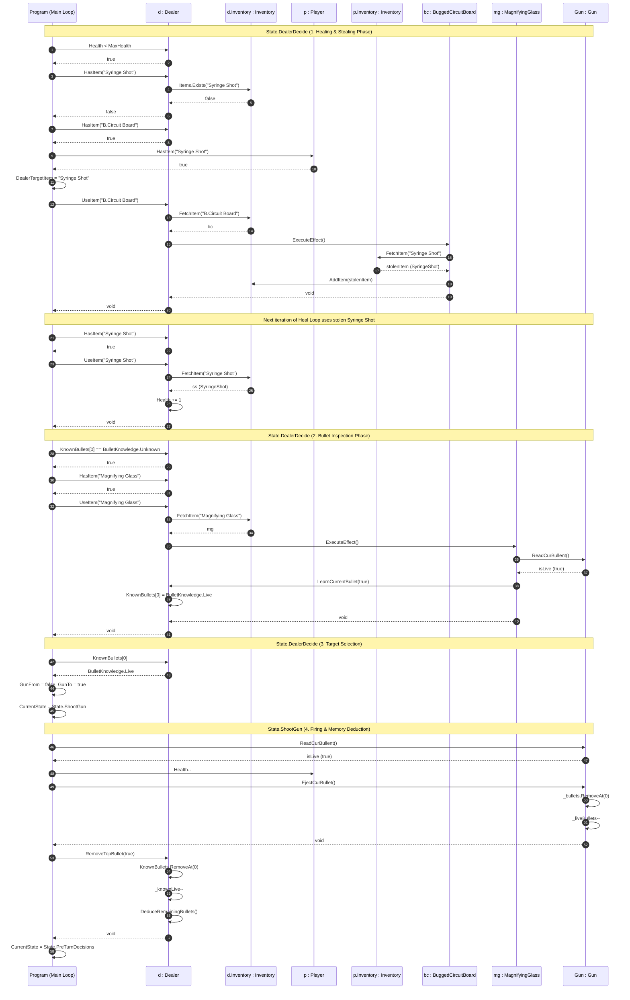

```mermaid
sequenceDiagram
    autonumber
    participant Prog as Program (Main Loop)
    participant D as d : Dealer
    participant DInv as d.Inventory : Inventory
    participant P as p : Player
    participant PInv as p.Inventory : Inventory
    participant BC as bc : BuggedCircuitBoard
    participant MG as mg : MagnifyingGlass
    participant G as Gun : Gun

    Note over Prog, G: State.DealerDecide (1. Healing & Stealing Phase)
    Prog->>D: Health < MaxHealth
    D-->>Prog: true
    Prog->>D: HasItem("Syringe Shot")
    D->>DInv: Items.Exists("Syringe Shot")
    DInv-->>D: false
    D-->>Prog: false
    Prog->>D: HasItem("B.Circuit Board")
    D-->>Prog: true
    Prog->>P: HasItem("Syringe Shot")
    P-->>Prog: true

    Prog->>Prog: DealerTargetItem = "Syringe Shot"
    Prog->>D: UseItem("B.Circuit Board")
    D->>DInv: FetchItem("B.Circuit Board")
    DInv-->>D: bc
    D->>BC: ExecuteEffect()
    BC->>PInv: FetchItem("Syringe Shot")
    PInv-->>BC: stolenItem (SyringeShot)
    BC->>DInv: AddItem(stolenItem)
    BC-->>D: void
    D-->>Prog: void

    Note over Prog, G: Next iteration of Heal Loop uses stolen Syringe Shot
    Prog->>D: HasItem("Syringe Shot")
    D-->>Prog: true
    Prog->>D: UseItem("Syringe Shot")
    D->>DInv: FetchItem("Syringe Shot")
    DInv-->>D: ss (SyringeShot)
    D->>D: Health += 1
    D-->>Prog: void

    Note over Prog, G: State.DealerDecide (2. Bullet Inspection Phase)
    Prog->>D: KnownBullets[0] == BulletKnowledge.Unknown
    D-->>Prog: true
    Prog->>D: HasItem("Magnifying Glass")
    D-->>Prog: true
    Prog->>D: UseItem("Magnifying Glass")
    D->>DInv: FetchItem("Magnifying Glass")
    DInv-->>D: mg
    D->>MG: ExecuteEffect()
    MG->>G: ReadCurBullent()
    G-->>MG: isLive (true)
    MG->>D: LearnCurrentBullet(true)
    D->>D: KnownBullets[0] = BulletKnowledge.Live
    MG-->>D: void
    D-->>Prog: void

    Note over Prog, G: State.DealerDecide (3. Target Selection)
    Prog->>D: KnownBullets[0]
    D-->>Prog: BulletKnowledge.Live
    Prog->>Prog: GunFrom = false, GunTo = true
    Prog->>Prog: CurrentState = State.ShootGun

    Note over Prog, G: State.ShootGun (4. Firing & Memory Deduction)
    Prog->>G: ReadCurBullent()
    G-->>Prog: isLive (true)
    Prog->>P: Health--
    Prog->>G: EjectCurBullet()
    G->>G: _bullets.RemoveAt(0)
    G->>G: _liveBullets--
    G-->>Prog: void

    Prog->>D: RemoveTopBullet(true)
    D->>D: KnownBullets.RemoveAt(0)
    D->>D: _knownLive--
    D->>D: DeduceRemainingBullets()
    D-->>Prog: void
    Prog->>Prog: CurrentState = State.PreTurnDecisions
```