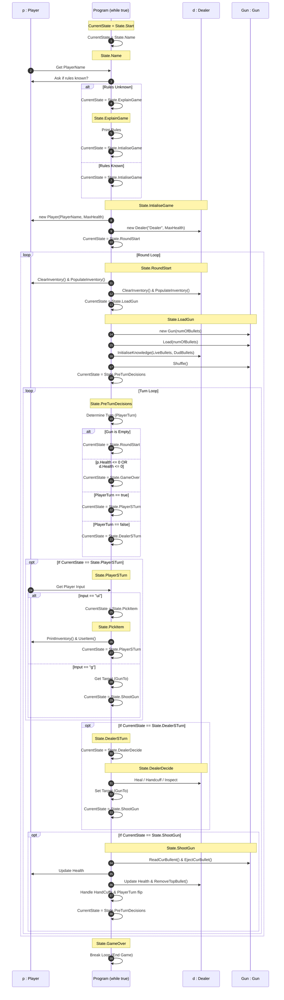

```mermaid
sequenceDiagram
    autonumber
    participant P as p : Player
    participant MainLoop as Program (while true)
    participant D as d : Dealer
    participant G as Gun : Gun

    Note over MainLoop: CurrentState = State.Start
    MainLoop->>MainLoop: CurrentState = State.Name

    Note over MainLoop: State.Name
    P->>MainLoop: Get PlayerName
    MainLoop->>P: Ask if rules known?
    alt Rules Unknown
        MainLoop->>MainLoop: CurrentState = State.ExplainGame
        Note over MainLoop: State.ExplainGame
        MainLoop->>MainLoop: Print Rules
        MainLoop->>MainLoop: CurrentState = State.IntialiseGame
    else Rules Known
        MainLoop->>MainLoop: CurrentState = State.IntialiseGame
    end

    Note over MainLoop, D: State.IntialiseGame
    MainLoop->>P: new Player(PlayerName, MaxHealth)
    MainLoop->>D: new Dealer("Dealer", MaxHealth)
    MainLoop->>MainLoop: CurrentState = State.RoundStart

    loop Round Loop
        Note over MainLoop, D: State.RoundStart
        MainLoop->>P: ClearInventory() & PopulateInventory()
        MainLoop->>D: ClearInventory() & PopulateInventory()
        MainLoop->>MainLoop: CurrentState = State.LoadGun

        Note over MainLoop, G: State.LoadGun
        MainLoop->>G: new Gun(numOfBullets)
        MainLoop->>G: Load(numOfBullets)
        MainLoop->>D: InitialiseKnowledge(LiveBullets, DudBullets)
        MainLoop->>G: Shuffle()
        MainLoop->>MainLoop: CurrentState = State.PreTurnDecisions

        loop Turn Loop
            Note over MainLoop: State.PreTurnDecisions
            MainLoop->>MainLoop: Determine Turn (PlayerTurn)
            
            alt Gun is Empty
                MainLoop->>MainLoop: CurrentState = State.RoundStart
            else p.Health <= 0 OR d.Health <= 0
                MainLoop->>MainLoop: CurrentState = State.GameOver
            else PlayerTurn == true
                MainLoop->>MainLoop: CurrentState = State.PlayerSTurn
            else PlayerTurn == false
                MainLoop->>MainLoop: CurrentState = State.DealerSTurn
            end

            opt If CurrentState == State.PlayerSTurn
                Note over MainLoop: State.PlayerSTurn
                P->>MainLoop: Get Player Input
                alt Input == "ui"
                    MainLoop->>MainLoop: CurrentState = State.PickItem
                    Note over MainLoop: State.PickItem
                    MainLoop->>P: PrintInventory() & UseItem()
                    MainLoop->>MainLoop: CurrentState = State.PlayerSTurn
                else Input == "g"
                    MainLoop->>MainLoop: Get Target (GunTo)
                    MainLoop->>MainLoop: CurrentState = State.ShootGun
                end
            end

            opt If CurrentState == State.DealerSTurn
                Note over MainLoop: State.DealerSTurn
                MainLoop->>MainLoop: CurrentState = State.DealerDecide
                Note over MainLoop, D: State.DealerDecide
                MainLoop->>D: Heal / Handcuff / Inspect
                MainLoop->>MainLoop: Set Target (GunTo)
                MainLoop->>MainLoop: CurrentState = State.ShootGun
            end

            opt If CurrentState == State.ShootGun
                Note over MainLoop, G: State.ShootGun
                MainLoop->>G: ReadCurBullent() & EjectCurBullet()
                MainLoop->>P: Update Health
                MainLoop->>D: Update Health & RemoveTopBullet()
                MainLoop->>MainLoop: Handle HandCuffs & PlayerTurn flip
                MainLoop->>MainLoop: CurrentState = State.PreTurnDecisions
            end
        end
    end

    Note over MainLoop: State.GameOver
    MainLoop->>MainLoop: Break Loop (End Game)
```
