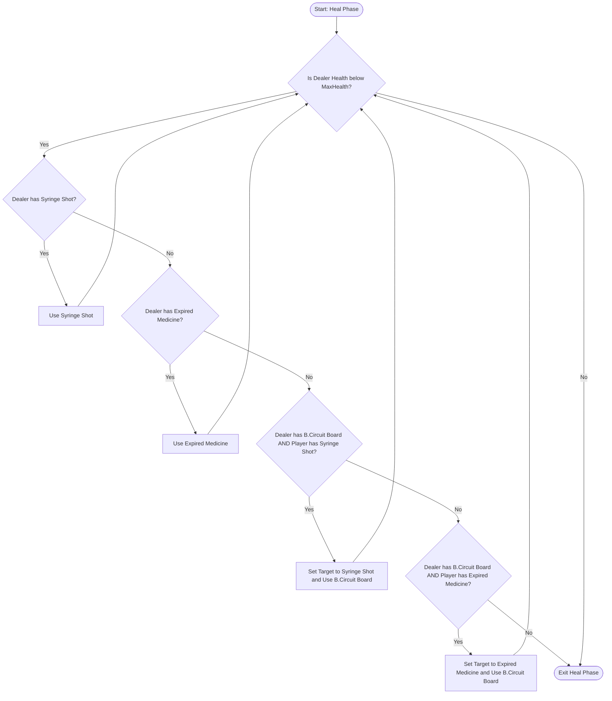

```mermaid
flowchart TD
    Start([Start: Heal Phase]) --> HealCheck{Is Dealer Health below MaxHealth?}

    HealCheck -->|Yes| HasSS{Dealer has Syringe Shot?}
    HasSS -->|Yes| UseSS[Use Syringe Shot] --> HealCheck

    HasSS -->|No| HasEM{Dealer has Expired Medicine?}
    HasEM -->|Yes| UseEM[Use Expired Medicine] --> HealCheck

    HasEM -->|No| StealSS{Dealer has B.Circuit Board AND Player has Syringe Shot?}
    StealSS -->|Yes| DoStealSS[Set Target to Syringe Shot and Use B.Circuit Board] --> HealCheck

    StealSS -->|No| StealEM{Dealer has B.Circuit Board AND Player has Expired Medicine?}
    StealEM -->|Yes| DoStealEM[Set Target to Expired Medicine and Use B.Circuit Board] --> HealCheck
    
    StealEM -->|No| EndHeal([Exit Heal Phase])
    HealCheck -->|No| EndHeal
```