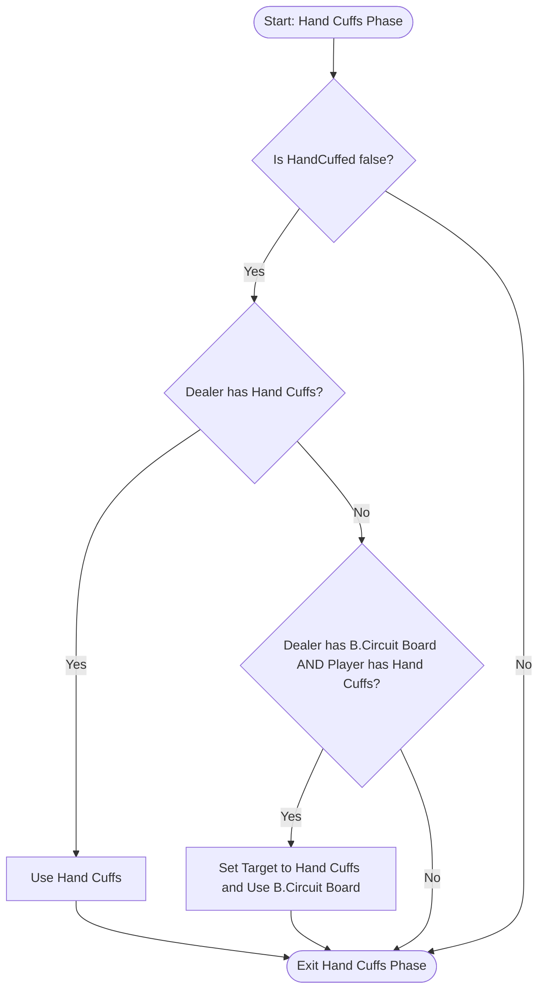

```mermaid
flowchart TD
    Start([Start: Hand Cuffs Phase]) --> CheckHC{Is HandCuffed false?}

    CheckHC -->|Yes| HasHC{Dealer has Hand Cuffs?}
    HasHC -->|Yes| UseHC[Use Hand Cuffs] --> EndHC([Exit Hand Cuffs Phase])
    
    HasHC -->|No| StealHC{Dealer has B.Circuit Board AND Player has Hand Cuffs?}
    StealHC -->|Yes| DoStealHC[Set Target to Hand Cuffs and Use B.Circuit Board] --> EndHC
    StealHC -->|No| EndHC
    
    CheckHC -->|No| EndHC
```