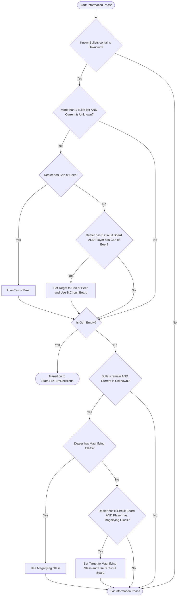

```mermaid
flowchart TD
    Start([Start: Information Phase]) --> CheckUnknown{KnownBullets contains Unknown?}

    CheckUnknown -->|Yes| CheckCB{More than 1 bullet left AND Current is Unknown?}
    
    CheckCB -->|Yes| HasCB{Dealer has Can of Beer?}
    HasCB -->|Yes| UseCB[Use Can of Beer] --> CheckEmpty
    
    HasCB -->|No| StealCB{Dealer has B.Circuit Board AND Player has Can of Beer?}
    StealCB -->|Yes| DoStealCB[Set Target to Can of Beer and Use B.Circuit Board] --> CheckEmpty
    StealCB -->|No| CheckEmpty
    
    CheckCB -->|No| CheckEmpty

    CheckEmpty{Is Gun Empty?} -->|Yes| Reload([Transition to State.PreTurnDecisions])
    
    CheckEmpty -->|No| CheckMG{Bullets remain AND Current is Unknown?}
    CheckMG -->|Yes| HasMG{Dealer has Magnifying Glass?}
    HasMG -->|Yes| UseMG[Use Magnifying Glass] --> EndInfo
    
    HasMG -->|No| StealMG{Dealer has B.Circuit Board AND Player has Magnifying Glass?}
    StealMG -->|Yes| DoStealMG[Set Target to Magnifying Glass and Use B.Circuit Board] --> EndInfo
    StealMG -->|No| EndInfo
    
    CheckMG -->|No| EndInfo
    CheckUnknown -->|No| EndInfo([Exit Information Phase])
```