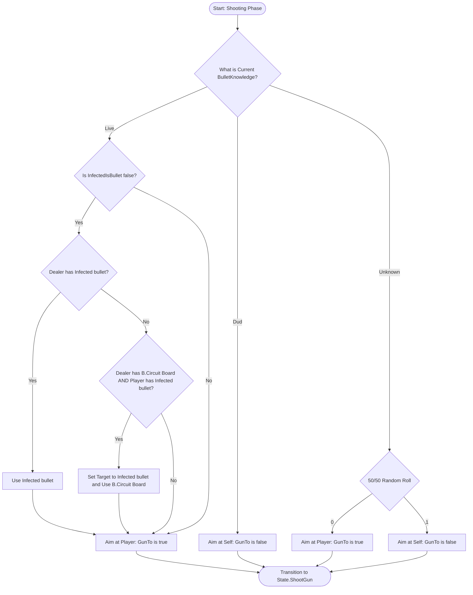

```mermaid
flowchart TD
    Start([Start: Shooting Phase]) --> EvalBullet{What is Current BulletKnowledge?}

    %% Live Bullet Path
    EvalBullet -->|Live| CheckIB{Is InfectedIsBullet false?}
    CheckIB -->|Yes| HasIB{Dealer has Infected bullet?}
    HasIB -->|Yes| UseIB[Use Infected bullet] --> ShootPlayerLive
    
    HasIB -->|No| StealIB{Dealer has B.Circuit Board AND Player has Infected bullet?}
    StealIB -->|Yes| DoStealIB[Set Target to Infected bullet and Use B.Circuit Board] --> ShootPlayerLive
    StealIB -->|No| ShootPlayerLive
    CheckIB -->|No| ShootPlayerLive

    ShootPlayerLive[Aim at Player: GunTo is true] --> EndState([Transition to State.ShootGun])

    %% Dud Bullet Path
    EvalBullet -->|Dud| ShootSelfDud[Aim at Self: GunTo is false] --> EndState

    %% Unknown Bullet Path
    EvalBullet -->|Unknown| RNG{50/50 Random Roll}
    RNG -->|0| ShootPlayerRNG[Aim at Player: GunTo is true] --> EndState
    RNG -->|1| ShootSelfRNG[Aim at Self: GunTo is false] --> EndState
```